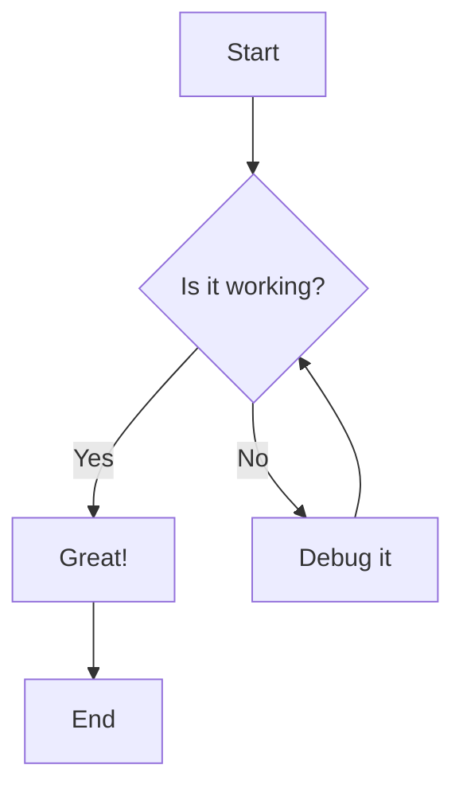
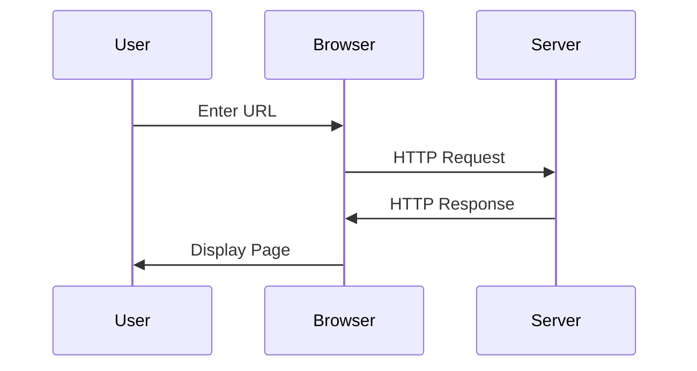
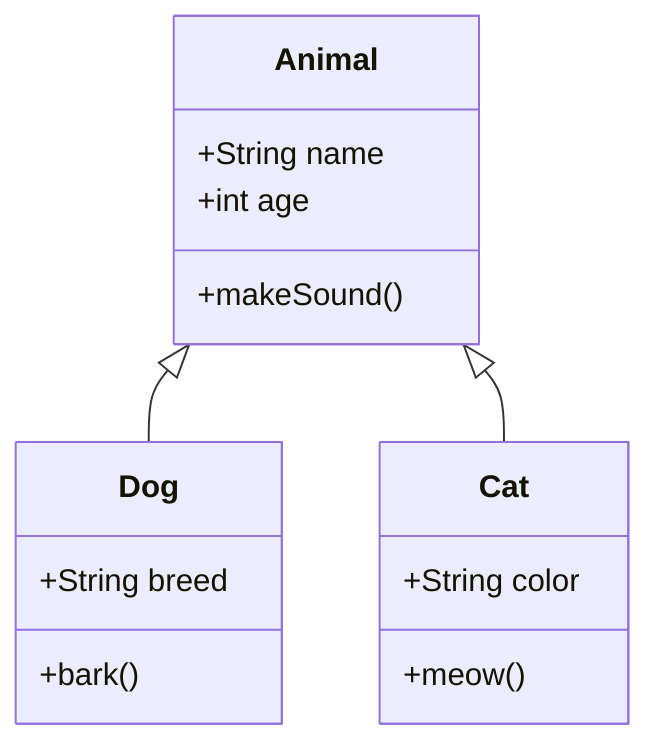
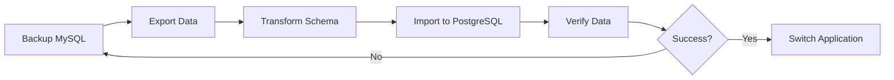

# Advanced Markdown Rendering Examples

This document showcases all the special rendering features available in this markdown viewer.

## 1. Emoji Shortcodes

I :heart: markdown! :smile: :rocket: :tada:

Let's celebrate :partying_face: :sparkles:

Common emojis: :thumbsup: :fire: :star: :eyes: :brain: :bulb: :zap:

## 2. Math Expressions (KaTeX)

### Inline Math

The quadratic formula is $x = \frac{-b \pm \sqrt{b^2-4ac}}{2a}$

Einstein's famous equation: $E = mc^2$

The Pythagorean theorem: $a^2 + b^2 = c^2$

### Block Math

$$
\int_{-\infty}^{\infty} e^{-x^2} dx = \sqrt{\pi}
$$

$$
\sum_{n=1}^{\infty} \frac{1}{n^2} = \frac{\pi^2}{6}
$$

$$
\nabla \times \vec{E} = -\frac{\partial \vec{B}}{\partial t}
$$

## 3. Callouts/Admonitions

:::note
This is a note callout with useful information. You can use this for general notes and information.
:::

:::warning
This is a warning - be careful! Use this for important warnings that users should pay attention to.
:::

:::tip
Here's a helpful tip for you. Use this for best practices and helpful advice.
:::

:::danger
Danger! This is critical information. Use this for critical warnings and errors.
:::

:::info
This is informational content. Similar to note but can be used for different semantic purposes.
:::

## 4. GitHub-Style Alerts

> [!NOTE]
> Useful information that users should know, even when skimming content.

> [!TIP]
> Helpful advice for doing things better or more easily.

> [!IMPORTANT]
> Key information users need to know to achieve their goal.

> [!WARNING]
> Urgent info that needs immediate user attention to avoid problems.

> [!CAUTION]
> Advises about risks or negative outcomes of certain actions.

## 5. Advanced Code Blocks

### With Filename

```typescript:src/app/app.component.ts
export class AppComponent {
  title = 'My App';

  constructor() {
    console.log('App initialized');
  }
}
```

### With Line Highlighting

```javascript{2,4-6}
function hello() {
  console.log('This line is highlighted');
  let x = 10;
  let y = 20;
  let z = 30;
  return x + y + z;
}
```

### With Diff Markers

```diff
function calculate(x, y) {
-  return x + y;
+  return x + y + z;
}

class Example {
-  oldMethod() {
-    return 'deprecated';
-  }
+  newMethod() {
+    return 'updated';
+  }
}
```

### Regular Syntax Highlighting

```python
def fibonacci(n):
    """Calculate the nth Fibonacci number."""
    if n <= 1:
        return n
    return fibonacci(n-1) + fibonacci(n-2)

# Generate first 10 Fibonacci numbers
for i in range(10):
    print(f"F({i}) = {fibonacci(i)}")
```

```javascript
// JavaScript example
const fetchData = async (url) => {
  try {
    const response = await fetch(url);
    const data = await response.json();
    return data;
  } catch (error) {
    console.error('Error fetching data:', error);
    throw error;
  }
};
```

## 6. Mermaid Diagrams

### Flowchart



### Sequence Diagram



### Class Diagram



## 7. Chart.js Charts

### Line Chart

```chart
type: line
labels: [Jan, Feb, Mar, Apr, May, Jun]
- label: Sales 2023
  data: [12, 19, 3, 5, 2, 10]
  borderColor: blue
- label: Sales 2024
  data: [5, 10, 15, 20, 25, 30]
  borderColor: green
```

### Bar Chart

```chart
type: bar
labels: [Q1, Q2, Q3, Q4]
- label: Revenue 2023
  data: [65, 59, 80, 81]
  backgroundColor: rgba(54, 162, 235, 0.5)
- label: Revenue 2024
  data: [28, 48, 40, 19]
  backgroundColor: rgba(255, 99, 132, 0.5)
```

## 8. Footnotes

Here's a sentence with a footnote.[^1]

You can also reference the same footnote multiple times.[^1]

And create multiple footnotes.[^2]

[^1]: This is the first footnote with some detailed explanation.
[^2]: This is the second footnote. You can use markdown here too: **bold**, *italic*, `code`.

## 9. GitHub Flavored Markdown Features

### Tables

| Feature | Status | Priority |
|---------|--------|----------|
| Emoji | ✅ Working | High |
| Math | ✅ Working | High |
| Charts | ✅ Working | Medium |
| Mermaid | ✅ Working | High |

### Task Lists

- [x] Implement KaTeX support
- [x] Add emoji shortcodes
- [x] Integrate Mermaid diagrams
- [x] Add Chart.js support
- [ ] Add table of contents
- [ ] Add print stylesheet

### Strikethrough

~~This text is crossed out~~

You can combine ~~strikethrough~~ with **bold** and *italic*.

### Autolinks

Visit https://github.com for more information.

Email: support@example.com

## Complete Example

Here's a real-world example combining multiple features:

# Database Migration Guide :database: :rocket:

> [!IMPORTANT]
> This guide requires PostgreSQL 14+ and Node.js 18+

## Overview

This guide explains how to migrate from MySQL to PostgreSQL. The migration formula is:

$$
\text{Migration Time} = \frac{\text{Data Size}}{\text{Network Speed}} + \text{Processing Time}
$$

:::warning
Always backup your database before starting migration!
:::

## Migration Process



## Performance Comparison

```chart
type: line
labels: [1K, 10K, 100K, 1M, 10M]
- label: MySQL Query Time (ms)
  data: [5, 12, 45, 180, 890]
  borderColor: orange
- label: PostgreSQL Query Time (ms)
  data: [3, 8, 32, 145, 720]
  borderColor: blue
```

## Migration Script

```typescript:scripts/migrate.ts{5-7}
import { Client } from 'pg';

async function migrate() {
  const client = new Client(config);
  await client.connect();
  // These lines show the critical migration steps
  await client.query('BEGIN');

  try {
    // Migration logic here
    await client.query('COMMIT');
    console.log('Migration successful! :tada:');
  } catch (error) {
    await client.query('ROLLBACK');
    throw error;
  }
}
```

> [!TIP]
> Use connection pooling for better performance during migration.

## Checklist

- [x] Export MySQL data
- [x] Transform schema
- [x] Test on staging
- [ ] Deploy to production
- [ ] Monitor performance

Made with :heart: by the DevOps team[^migration]

[^migration]: For support, contact devops@example.com

---

## Summary

This markdown viewer supports:
- :sparkles: Emoji shortcodes
- $\LaTeX$ math rendering
- 📊 Charts and diagrams
- 🎨 Syntax highlighting
- 📝 GitHub Flavored Markdown
- And much more!
